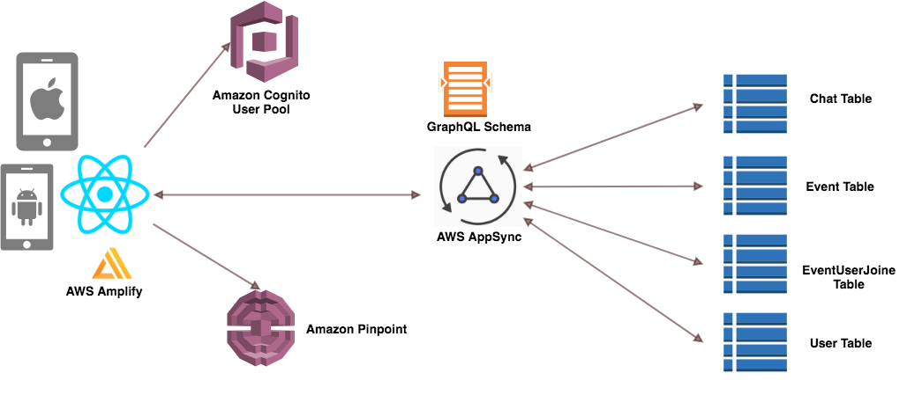

# React Native The AWSome Way!

This is a self-paced workshop designed for developers who want to build a React Native mobile application using mobile services from Amazon Web Services (AWS).

## Reference Architecture

Our application allow users to create meetups and also to join existing meetups. Each meetup has also a chat feature to let users discuss about the event.

### Screenshots

The data model will consist of:
* **Users**: a list of users who are using the app
* **Events**: a list of events created by the users in the app
* **Chats**: a list of chat messages created in the event by users
* **EventUserJoined**: a joint table between users and events to indicate who is joining which events

Our mobile application will be written in [React Native](https://facebook.github.io/react-native/). We will also be using [AWS Amplify](https://aws-amplify.github.io/amplify-js/index.html). AWS Amplify provides a declarative and make it really easy to add features like authentication and analytic to our mobile application. Our backend will be powered by AWS AppSnyc, a fully managed GraphQL service. AWS AppSync defines a GraphQL Schema with data types and GraphQL operations (query, mutation and subscription). It also associate a set of resolvers to Amazon DynamoDB, where we have 4 tables for our data models.

## [Lab 0](setup/)
Setup AWS Cloud9 and expo client

## [Lab 1](mobilehub/)
Setup React Native development environment.
Setup AWS Mobile Hub

## [Lab 2](appsync/)
Setup AppSync

## [Lab 3](app/)
Run your React Native App on your Mobile Device!

## [Lab 4](cicd/)
CI/CD for your React Native App

#####  FootNote
**Boh Jio** : You didn't invite me. Hokkien or Teochew pronunciation of "無招" (Mandarin 没招 méi-zhāo). *Reference: Singlish Vocabulary* (https://en.wikipedia.org/wiki/Singlish_vocabulary)

## Clean up

If you ever need to clean up your AWS account, here's the list of AWS services to terminate:

1. AWS Cloud9
2. AWS Mobile Hub
3. AWS AppSync
4. Amazon DynamoDB
5. Amazon S3
6. Cognito UserPool